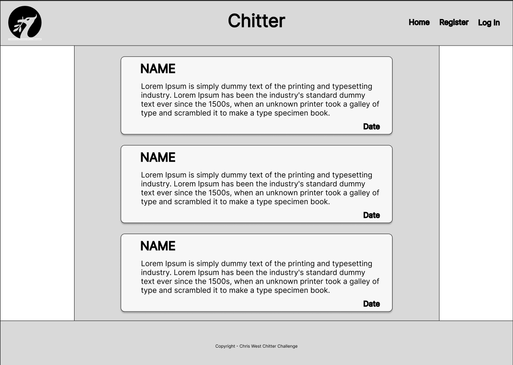
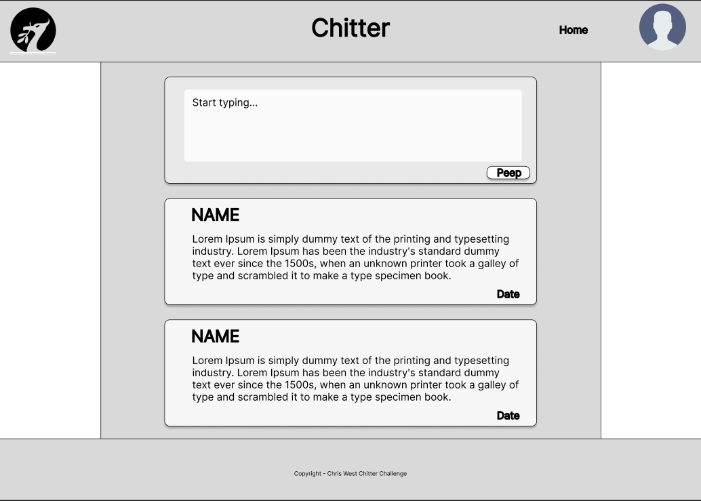
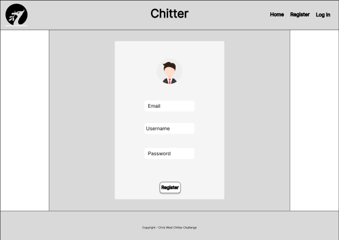
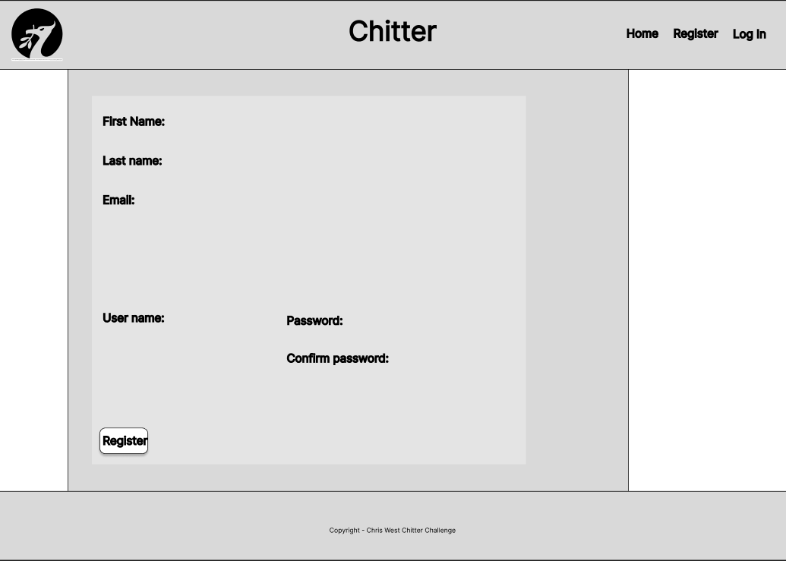

Chitter Challenge
=================

```
                    ___
                _.-'   ```'--.._
              .'                `-._
             /                      `.
            /                         `.
           /                            `.
          :       (                       \
          |    (   \_                  )   `.
          |     \__/ '.               /  )  ;
          |   (___:    \            _/__/   ;
          :       | _  ;          .'   |__) :
           :      |` \ |         /     /   /
            \     |_  ;|        /`\   /   /
             \    ; ) :|       ;_  ; /   /
              \_  .-''-.       | ) :/   /
             .-         `      .--.'   /
            :         _.----._     `  <
            :       -'........'-       `.
             `.        `''''`           ;
               `'-.__                  ,'
                     ``--.   :'-------'
                         :   :
                        .'   '.

```
The attached code has been created using React for the front-end and creating a back-end with Node.js. MongoDB has been used for the database.


## About the project
---
### Why does this project exist?
This project was created to test if I can create a full stack greenfield project and to highlight my skills using:

Axios
Bootstrap
Cors
Dotenv
Express
Express validator
MongoDB
Mongoose
Node
React

Furthermore, it was created to demonstrate how I have developed during my journey within the Digital Futures academy after 10 weeks.

## Getting started
### Start the project
Install the dependencies for the project by copying the following into the terminal:
```sh
$ npm install
```
To run the frontend. Within the "chitter-front-end" folder, copy the following code into the terminal:
```sh
$ npm start
```
To run the server. Within the "chitter-back-end" folder, copy the following code into the terminal:
```sh
$ npm start
```

### Test the project
Install the dependencies for the project by copying the following into the terminal:
```sh
$ npm install
```
To run the frontend tests. Within the "chitter-front-end" folder, copy the following code into the terminal:
```sh
$ npm test
```
To run the backend tests. Within the "chitter-back-end" folder, copy the following code into the terminal:
```sh
$ npm test
```
To run the test database. Within the "chitter-back-end" folder, copy the following code into the terminal:
```sh
$ npm run test-server
```

## Problem statements
---
### Task
We are going to write a small twitter clone that will allow users to post messages to a public wall.
### Acceptance Criteria
```
As a trainee software engineer
So that I can let people know what I am doing  
I want to post a message (peep) to chitter

As a trainee
So that I can see what others are saying  
I want to see all peeps in reverse chronological order

As a trainee
So that I can better appreciate the context of a peep
I want to see the time at which it was made

As a trainee
So that I can post messages on Chitter as me
I want to sign up for Chitter

As a trainee
So that only I can post messages on Chitter as me
I want to log in to Chitter

As a trainee
So that I can avoid others posting messages on Chitter as me
I want to log out of Chitter
```
### Additional requirements:
------

* You don't have to be logged in to see the peeps.
* Trainee software engineers sign up to chitter with their email, password, name and a username (e.g. ewithers@digitalfutures.com, password123, Edward Withers, dearshrewdwit).
* The username and email are unique.
* Peeps (posts to chitter) have the name of the trainee and their user handle.
* Your README should indicate the technologies used, and give instructions on how to install and run the tests.

### Extended Acceptance Criteria

```
As a trainee
So that I can stay constantly tapped in to the shouty box of Chitter
I want to receive an email if I am tagged in a Peep

As a trainee
In order to start a conversation as a DFA trainee Software Engineer
I want to reply to a peep from another trainee.
```
### Wireframes
#### Homepage - not logged in


#### Homepage - logged in


#### Login page


#### Register page

